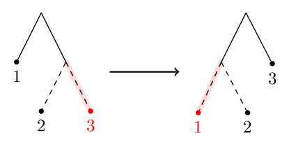
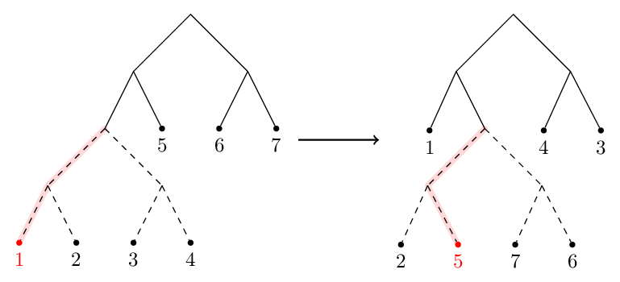
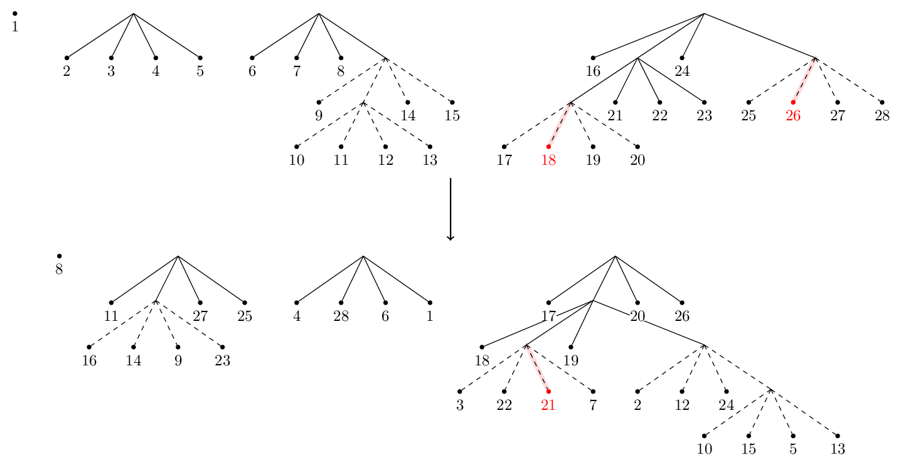

Drawing automorphisms
=====================

It can be helpful to see automorphisms rather than just read a description of them.
To that end we introduce functions for rendering automorphisms as tree pair diagrams.
The output looks best for automorphisms with a small arity (2--5) and a reasonable number of leaves.

Examples
--------

First we take a well-behaved automorphism. 
The solid carets are those belonging to both the domain and range trees.
All other carets are dotted.
Some edges are highlighted in red---these correspond to the repellers and attractors discussed by [SD10]_.

.. sourcecode:: python

	>>> from thompson import *
	>>> x0 = standard_generator(0)
	>>> plot(x0)
	>>> forest(x0)

.. image:: _static/images/x0_plot.svg
	:alt: A plot of the standard generator x_0 of Thompson's group F.
	:target: `thompson.drawing.plot`_
	

Discontinuities are fine too. Here's ``example_4_17`` for instance.

.. sourcecode:: python

	>>> pond = load_example('example_4_17')
	>>> plot(pond, discontinuities=True)
	>>> forest(pond)

.. image:: _static/images/pond_plot.svg
	:alt: A plot of a specific element of G_{2,1}.
	:target: `thompson.drawing.plot`_
	

Let's aim for something more chaotic.
This example is complicated enough that the drawings don't really give us much insight into the automorphism.

.. sourcecode:: python

	>>> random = random_automorphism() #different every time!
	>>> plot(random)
	>>> forest(random, horiz=False)

.. image:: _static/images/random_plot.svg
	:alt: A plot of a randomly generated element of G_{3,4}.
	:target: `thompson.drawing.plot`_
	

Drawing functions
-----------------

.. automodule:: thompson.drawing
	:members:
	:undoc-members:
